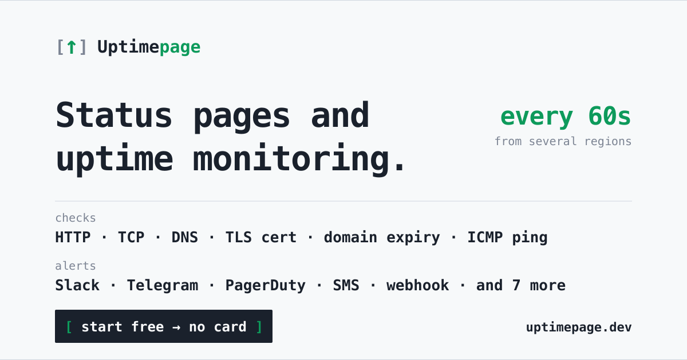
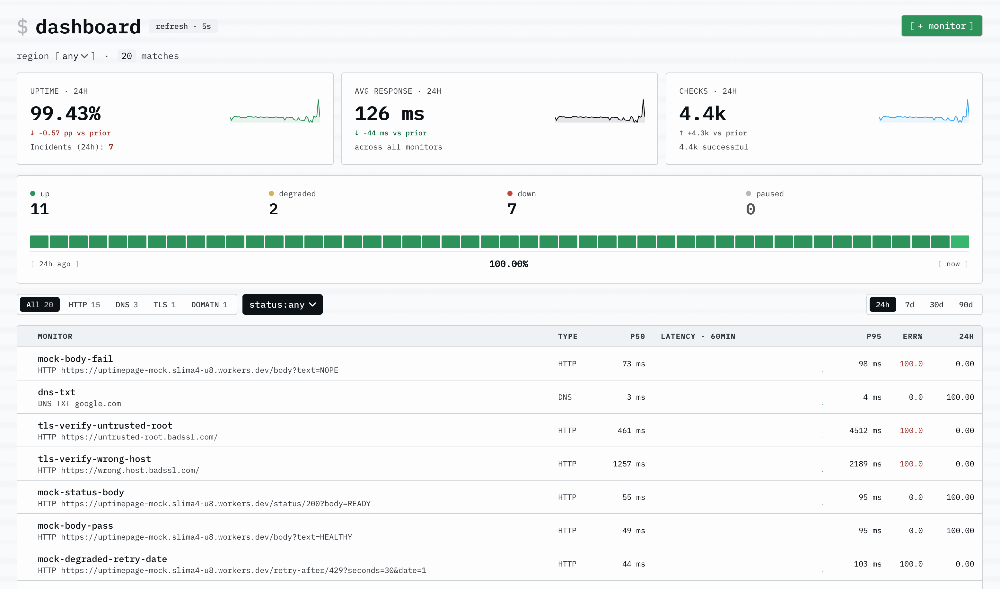
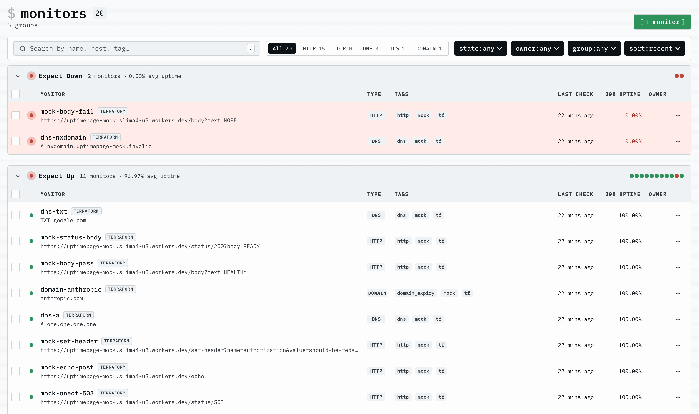

<div align="center">



# uptimepage

**Status pages + uptime monitoring. Free forever. Live in 5 minutes.**

Monitor HTTP, TCP, DNS, TLS-certificate and domain expiry from multiple
regions — then turn green and red into a polished public status page your
customers can subscribe to. Drive it by click, REST API, or Terraform.
Self-host the single binary or use the hosted service.

[](https://github.com/uptimepage/uptimepage/actions/workflows/docs.yml)
[](https://registry.terraform.io/providers/uptimepage/uptimepage)
[](LICENSE)

[**Try it free →**](https://uptimepage.dev)&nbsp;&nbsp;·&nbsp;&nbsp;[Docs](https://uptimepage.github.io/uptimepage/)&nbsp;&nbsp;·&nbsp;&nbsp;[Self-host](#self-host)&nbsp;&nbsp;·&nbsp;&nbsp;[Terraform](#terraform)&nbsp;&nbsp;·&nbsp;&nbsp;[MCP](#mcp-server)



</div>

## Why uptimepage

Monitoring with a built-in status page isn't new — the bet here is doing it
free, self-hostable, and fully as code:

- **Free hosted tier, no card** — and AGPL if you'd rather run it yourself.
- **One self-contained binary** — `docker compose up` and you're live, not a Kubernetes platform to operate.
- **Everything as code** — REST API, scoped tokens, an official Terraform provider, and an MCP server your LLM can query.
- **Probes you own** — run multi-region agents wherever your users are, on your own boxes.
- **Status page + incidents + escalation in one** — components, subscribers, on-call, no second tool.
- **No per-seat or feature-gated tiers** — checks, status pages, and subscribers aren't paywalled.

### Who it's for

- **Founders / small SaaS** — a professional status page in minutes, free, no self-host headache.
- **Platform / SRE leads** — monitors as code, multi-region, escalation and incidents, without vendor sprawl.
- **Self-hosters** — one binary plus two databases, no SaaS lock-in.

## Features

| | |
|---|---|
| **Checks** | HTTP, TCP, DNS, TLS-cert expiry, domain expiry — per-host circuit breaking, designed for ~50k concurrent in-flight |
| **Public status page** | HTML + JSON + RSS, per-component opt-in, incident narration, maintenance windows, email + webhook subscribers |
| **Alerting** | Slack, generic webhook, Telegram, SMS, … — per-org channels, sealed secrets, fire-once + recovery |
| **Incidents** | Internal incident state ⊥ public phase, escalation policies, on-call schedules |
| **Multi-region** | Regional probe agents, per-region views, run your own agent anywhere |
| **Automation** | REST API, scoped API tokens, Terraform provider, MCP server for LLM clients |
| **Built on** | Rust 1.95 / Tokio / Axum, Postgres + ClickHouse, one ~23 MB self-contained binary |

**Live service: <https://uptimepage.dev>** — hosted, free, sign in with GitHub.
**Full docs: <https://uptimepage.github.io/uptimepage/>**

<div align="center">



</div>

## Check types

| Type | Purpose | Default interval | Floor |
|---|---|---|---|
| `http` | request a URL, match status / body / latency | 60 s | `max(plan_min, 10 s)` |
| `tcp` | open a TCP socket within a timeout | 60 s | `max(plan_min, 10 s)` |
| `dns` | resolve a record, optionally match a value | 60 s | `max(plan_min, 10 s)` |
| `tls_cert` | open TLS, parse leaf cert, alert before `notAfter` | 86 400 s (daily) | `max(plan_min, 3600 s)` |
| `domain_expiry` | query RDAP, alert before the domain's `expiration` event | 86 400 s (daily) | `max(plan_min, 3600 s)` |

`tls_cert` and `domain_expiry` use `warn_days` / `critical_days` thresholds and surface `days_remaining` plus registrar / cert subject in the result payload. Their floor is 1 hour regardless of plan — these probes track values that change on a scale of days, not minutes. See [docs/api.md](docs/api.md) for the full payload shapes.

## Public status page

A customer-facing `/status` page (HTML + JSON + RSS 2.0) is built into the binary. Per-target opt-in via `public_status`; the page bypasses basic auth at the Caddy layer with a per-IP rate limit, caches for 10 s in-process, and degrades gracefully if ClickHouse is unreachable. Operators narrate incidents (`PATCH /api/v1/incidents/{id}`, `POST /api/v1/incidents/{id}/updates`) and schedule maintenance windows (`POST /api/v1/maintenance`). Visitors subscribe for email or webhook updates. See [docs/public-status.md](docs/public-status.md).

## Alerting

Notification channels are per-org resources (Slack incoming webhook, generic
HTTP webhook, Telegram bot, SMS gateway, …) created via `/api/v1/notification-channels`.
Transport secrets are sealed at rest and never echoed back. A target opts in
by binding one or more channels in its `alerts` array:

```jsonc
"alerts": [
  { "channel_id": "0192…", "after_failures": 3 },
  { "channel_id": "0193…", "after_failures": 6, "notify_recovery": false }
]
```

Fire-once + recovery semantics. Channels are tenant-isolated — a target can
only bind a channel its own org owns. See [docs/api.md](docs/api.md) for the
full contract.

## Multi-region

Run probe agents in the regions your users live in; the control plane assigns
checks per region and the dashboard and status page can be viewed per-region.
Bring your own agent anywhere — a single binary with an org-scoped token. See
[docs/multi-region.md](docs/multi-region.md).

## Terraform

Manage targets and notification channels as code with the official provider
[`uptimepage/uptimepage`](https://registry.terraform.io/providers/uptimepage/uptimepage)
([source](https://github.com/uptimepage/terraform-provider-uptimepage)):

```hcl
terraform {
  required_providers {
    uptimepage = {
      source = "uptimepage/uptimepage"
    }
  }
}

provider "uptimepage" {
  token = var.uptimepage_token # or set UPTIMEPAGE_TOKEN
  org   = "your-org-slug"      # required for managed resources; or UPTIMEPAGE_ORG
  # endpoint defaults to https://app.uptimepage.dev; set it for a self-hosted instance
}

resource "uptimepage_target" "api" {
  name     = "api prod"
  interval = 60
  check = {
    type = "http"
    http = {
      url             = "https://example.com/healthz"
      expected_status = { kind = "exact", exact = 200 }
    }
  }
}
```

## MCP server

An [MCP](https://modelcontextprotocol.io) server lets an LLM client (the claude.ai connector, Claude Desktop, an IDE) answer questions about one org's monitors and take a few guarded actions, over Streamable HTTP at `/mcp`. Seven read-only tools plus four write tools (each scope-gated, confirmed per action, and audited). Auth is an org-bound scoped token — paste one by hand, or use the one-click OAuth 2.1 connector. Off by default; enable with `UPTIMEPAGE_MCP_ENABLED=true` (`+ MCP_OAUTH_ENABLED` for the connector). See [docs/mcp.md](docs/mcp.md).

## Self-host

### Docker (recommended)

```bash
docker compose up -d
```

Brings up Postgres 17, ClickHouse 26.3, and the monitor. Migrations for both databases run at process startup — no init-script wiring, no external migrator.

Create a target:

```bash
curl -X POST http://127.0.0.1:8080/api/v1/targets \
  -H 'content-type: application/json' \
  -d '{
    "name": "example",
    "check": {
      "type": "http",
      "url": "https://example.com/",
      "method": "GET",
      "timeout": 5000,
      "follow_redirects": false,
      "max_redirects": 0,
      "expected_status": { "kind": "exact", "value": 200 },
      "headers": {},
      "verify_tls": true
    },
    "interval": 60,
    "enabled": true,
    "tags": []
  }'
```

Read uptime, scrape metrics:

```bash
curl http://127.0.0.1:8080/api/v1/targets/<id>/uptime
curl http://127.0.0.1:9090/metrics
```

### Production deployment

For a production deployment with TLS, basic auth, and proper hardening (Caddy edge, Postgres + ClickHouse internal-only, ClickHouse memory cap), see [`deployment/README.md`](deployment/README.md) or [docs/deployment.md](docs/deployment.md). The local dev stack above is fine for evaluation; do not expose it to the internet.

### Local build

```bash
cargo build --release
./target/release/uptimepage
```

Requires Postgres and ClickHouse reachable at the URLs in `config/default.toml`. To run against the compose stack without rebuilding the container:

```bash
docker compose up -d postgres clickhouse
cargo run --release
```

## Docs

Hosted: <https://uptimepage.github.io/uptimepage/>

Sources under [`docs/`](docs/) — readable directly on GitHub too:

| File | Covers |
|---|---|
| [docs/architecture.md](docs/architecture.md) | goals, module layout, data flow, key design choices, concurrency model |
| [docs/api.md](docs/api.md) | REST endpoints, check-spec payload shapes, result + uptime queries |
| [docs/public-status.md](docs/public-status.md) | operator guide to the public `/status` page: components, incidents, maintenance |
| [docs/authentication.md](docs/authentication.md) | sign-in, sessions, scoped API tokens, org binding |
| [docs/multi-region.md](docs/multi-region.md) | regional probe agents, the operator surface, running an agent, per-region views |
| [docs/mcp.md](docs/mcp.md) | MCP server for LLM clients: tools, scopes, OAuth connector, enabling, examples |
| [docs/configuration.md](docs/configuration.md) | `default.toml` reference, env override scheme, tuning notes |
| [docs/metrics.md](docs/metrics.md) | Prometheus series (incl. connect / TLS / pool gauges), OpenTelemetry tracing |
| [docs/deployment.md](docs/deployment.md) | Docker, bind addresses, migrations, sizing, graceful shutdown |
| [docs/development.md](docs/development.md) | local dev workflow, the web UI (stack, routes, adding a page, tests), faster builds |
| [docs/loadtest.md](docs/loadtest.md) | `bin/loadtest` envs, macOS gotchas, HTTP/1 vs h2c trade-off, Linux container path |
| [docs/benchmarks.md](docs/benchmarks.md) | Criterion micro-benchmarks, single-core throughput, profile breakdown |
| [docs/troubleshooting.md](docs/troubleshooting.md) | common failures and how to read them off metrics |

## Web UI

The single binary serves both the `/api/v1/*` JSON surface and a server-rendered HTML UI at `/` — askama compile-time templates, HTMX for partial swaps and JSON forms (no SPA framework), Tailwind CSS 4, and lazy-loaded ECharts. Every UI mutation hits an existing `/api/v1/*` endpoint, so the API stays the single source of truth. Stack, routes, the add-a-page recipe, and UI tests are in [docs/development.md](docs/development.md#web-ui).

## Legal

A running instance serves its policies at `/terms`, `/privacy`, `/cookies`,
`/impressum`, `/abuse-policy`, `/security-policy`, and an RFC 9116
`/.well-known/security.txt`. The source documents are in
[`docs/legal/`](docs/legal/). GDPR self-service (data export, account
deletion, recovery) lives under `/settings/account`.

## License

uptimepage is licensed under [AGPL-3.0](LICENSE). See [LICENSING.md](LICENSING.md)
for what this means in practice.

If you'd like to contribute, see [CONTRIBUTING.md](CONTRIBUTING.md).
For security disclosures, see [SECURITY.md](SECURITY.md).
</content>
</invoke>
